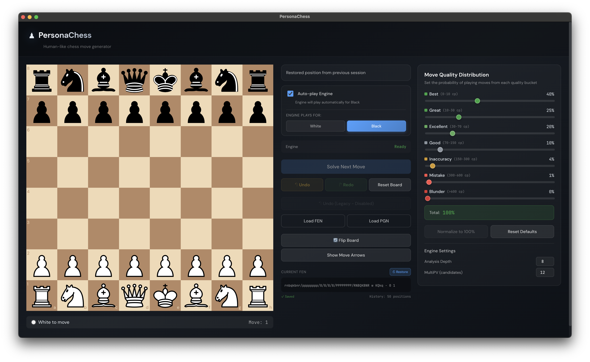

# PersonaChess

PersonaChess is an Electron desktop chess app that uses Stockfish for analysis, then deliberately chooses moves through configurable human-like quality buckets instead of always playing the top engine line.



## What It Does

- Play on an interactive board with drag/drop or click-to-move
- Ask the engine to play one move manually or let it auto-play for White or Black
- Load positions from `FEN`, games/lines from `PGN`, or built-in openings
- Tune how often the engine plays `Best`, `Great`, `Excellent`, `Good`, `Inaccuracy`, `Mistake`, and `Blunder` moves
- Enable optional advanced behaviors with independent feature toggles
- Persist local board state, engine configuration, and brilliant-move session data when enabled

## Personas And Presets

Move quality presets shape the overall style of play:

- `Low`: easier play, more inaccuracies and mistakes
- `Medium`: balanced default
- `Hard`: stronger play with mostly best/great moves
- `Super Hard`: near-engine play
- `Aggressive`: more risky and tactical distributions

These presets control bucket percentages only. Optional advanced toggles can further influence selection.

## Advanced Feature Flags

All advanced options are independent. You can mix old and new behavior safely.

- `securityDevToolsOnly`
  Limits automatic DevTools opening to development builds only.
- `persistEngineConfig`
  Persists depth, MultiPV, preset, bucket percentages, feature options, session board state, and brilliant tracking.
- `useDeterministicRng`
  Uses seeded move selection for reproducible sessions.
- `useMoveAnalysisCache`
  Reuses Stockfish analysis by `FEN + depth + MultiPV`.
- `useImprovedMoveClassification`
  Uses smarter fallback logic and keeps unknown moves out of `Good` by default.
- `usePositionComplexity`
  Adjusts move-quality weights slightly based on how sharp the position is.
- `usePersonaBehaviorBias`
  Adds lightweight aggressive/safe/tactical preferences on top of bucket choice.
- `useHumanDelaySimulation`
  Adds persona/complexity-based delay before engine auto-play moves.
- `useBrilliantMoveBudget`
  Allows a per-game budget of tactical “brilliant” moves with phase restrictions.

## Brilliant Move Budget

When enabled, PersonaChess can reserve a fixed number of brilliant moves per game.

- `brilliantMovesPerGame`: `0` to `4`
- `brilliantAllowedPhase`: `opening`, `middlegame`, `endgame`, or `any`
- Tactical preference is based on checks, captures, promotions, and similar sharp traits
- Budget is consumed only after a brilliant move is actually played
- Undo/redo and restored sessions keep brilliant tracking consistent

## Architecture

PersonaChess follows MVVM:

- `src/engine`
  Pure TypeScript logic for Stockfish integration, move classification, picking, caching, RNG, complexity, persona bias, brilliant selection, and supporting helpers
- `src/viewmodels`
  MobX stores coordinating board state, engine state, configuration, feature options, and debug state
- `src/renderer`
  React components that render the UI and call ViewModel actions
- `src/main.ts`
  Electron main process with production hardening and Forge/Vite bootstrapping
- `src/preload.ts`
  Minimal context-bridge surface for syncing feature options to the main process

## Requirements

- Node.js 18 or newer recommended
- npm
- macOS, Windows, or Linux for local Electron builds

## Setup

```bash
npm install
```

The `postinstall` step copies `stockfish.js` and `stockfish.wasm` into `public/`.

## Run In Development

```bash
npm start
```

Notes:

- The app runs with Electron Forge + Vite
- DevTools can be opened in development when the security option allows it
- A debug logging toggle is available in the app during development

## Tests And Lint

```bash
npm test
npm run lint
```

## Production Packaging

Package the app locally:

```bash
npm run package
```

Create a platform distributable:

```bash
npm run make
```

Current packaging metadata:

- App name: `PersonaChess`
- Bundle identifier: `com.imokhles.personachess`
- macOS category: `Games`
- App icon: `assets/icon.icns`

## Release Notes

This release-readiness pass includes:

- DevTools restricted to development builds only
- Hardened Electron window settings with `contextIsolation`, `sandbox`, `nodeIntegration: false`, blocked navigation, and denied permission prompts
- Minimal preload bridge
- Reduced runtime logging noise behind a debug toggle
- Cache/source visibility and clearer analysis state in the UI
- Persisted move annotations for stable brilliant undo/redo after restart

## Troubleshooting

### The app opens but the engine never starts

- Re-run `npm install` so `postinstall` recopies `stockfish.js` and `stockfish.wasm`
- Confirm both files exist in `public/`
- Check the in-app engine error message in the control panel

### Stockfish or WASM fails after packaging

- Verify `public/stockfish.js` and `public/stockfish.wasm` are included in the packaged app resources
- Rebuild with `npm run package`
- If you changed asset paths, make sure the worker still loads `/stockfish.js`

### Packaging fails on your platform

- `npm run package` is the easiest smoke check for a local release
- `npm run make` depends on the maker available for your platform
- On macOS, the default distributable is a `.zip`
- Linux makers may require additional native packaging tools when run on Linux

### The engine feels noisy in the terminal

- Use the in-app `Debug logs` toggle in development to turn verbose logs on or off
- In packaged builds, debug logs stay off by default

### Persisted state feels stale

- Disable and re-enable `Persist Engine Configuration` to clear persisted advanced settings
- Reset the board or load a new `FEN`/`PGN` to start a fresh game session

## Scripts

- `npm start`: run the Electron app in development
- `npm run package`: build a local packaged app
- `npm run make`: create a platform distributable
- `npm test`: run the local regression tests
- `npm run lint`: run ESLint

## Project Structure

```text
src/
  engine/
  renderer/
  viewmodels/
  main.ts
  preload.ts
public/
  stockfish.js
  stockfish.wasm
assets/
  icon.svg
  icon.icns
tests/
```

