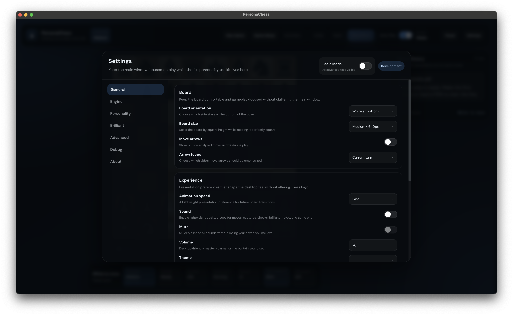

# PersonaChess

PersonaChess is a desktop chess application built with Electron, React, TypeScript, and MobX. It uses Stockfish for analysis, but instead of always choosing the top move, it can deliberately play through configurable human-like quality buckets to create more varied and personality-driven games.

## Screenshots

### Main Board


### Settings Modal



## Highlights

- Interactive desktop chess board with drag-and-drop and click-to-move
- Manual engine move solving or automatic engine play for White or Black
- Personality presets that bias move quality distribution
- Independent advanced feature toggles for cache, deterministic RNG, complexity, bias, brilliant-move budgeting, and more
- Game Setup modal for openings, tactical positions, endgames, custom FEN, and custom PGN
- Saved persona profiles with JSON import and export
- Session summaries, recent game analytics, and PGN / JSON export
- Local persistence for board state, engine configuration, UI preferences, and recent completed games

## How PersonaChess Works

PersonaChess separates analysis from move choice:

1. Stockfish analyzes the current position.
2. Candidate moves are classified into quality buckets such as `Best`, `Great`, `Good`, `Inaccuracy`, `Mistake`, and `Blunder`.
3. A bucket is selected from the active configuration.
4. A legal move is chosen from that bucket and played.

This lets the app feel much less robotic than a traditional "always best move" engine opponent.

## Core Features

### Play

- Interactive board controls
- Undo / redo
- Reset board
- Load FEN
- Load PGN
- Export current PGN through the summary flow

### Personas

- `Low`
- `Medium`
- `Hard`
- `Super Hard`
- `Aggressive`

These presets shape the move-quality distribution. Optional advanced features can layer on additional behavior without replacing the base preset system.

### Game Setup

- Built-in openings
- Tactical positions
- Endgames
- Custom FEN
- Custom PGN

### Advanced Systems

- Deterministic RNG
- Analysis cache
- Improved move classification
- Position complexity adjustments
- Persona behavior bias
- Human delay simulation
- Brilliant move budget

### Gameplay Polish

- Desktop sound cues for move events
- Move feedback toast
- Autoplay countdown and pause / resume
- Keyboard shortcuts
- Recent game summaries and analytics

## Feature Flags

All advanced options are independent, so old and new behaviors can be mixed safely.

- `securityDevToolsOnly`
  Restricts automatic DevTools opening to development builds.
- `persistEngineConfig`
  Persists engine settings, feature options, UI preferences, and session data.
- `useDeterministicRng`
  Uses seeded random selection for reproducible sessions.
- `useMoveAnalysisCache`
  Reuses analysis for the same `FEN + depth + MultiPV`.
- `useImprovedMoveClassification`
  Keeps unknown moves out of `Good` by default and uses smarter fallback logic.
- `usePositionComplexity`
  Slightly adjusts bucket weights based on position sharpness.
- `usePersonaBehaviorBias`
  Adds lightweight aggressive / safe move preferences on top of bucket selection.
- `useHumanDelaySimulation`
  Delays autoplay moves based on complexity, persona, and chosen move quality.
- `useBrilliantMoveBudget`
  Reserves a small tactical brilliant-move budget per game.

## Saved Profiles

PersonaChess supports saved persona profiles that can include:

- Bucket percentages
- Active preset
- Depth and MultiPV
- Feature options
- Brilliant-move settings
- Theme and basic UI mode

Profiles can be:

- Saved
- Loaded
- Renamed
- Duplicated
- Deleted
- Exported as JSON
- Imported from validated JSON

## Game Analytics

Each completed game can generate a summary including:

- Move quality counts
- Brilliant moves
- Inaccuracies, mistakes, and blunders
- Average eval loss
- Average move delay
- Complexity distribution
- Setup used
- Persona used
- Autoplay duration
- Recent games history

The Game Summary modal also supports:

- JSON export
- PGN export
- Recent game browsing

## Architecture

PersonaChess follows an MVVM structure:

- `src/engine`
  Pure TypeScript engine and model helpers
- `src/viewmodels`
  MobX stores coordinating game state, engine state, UI state, setup flow, profiles, and analytics
- `src/renderer`
  React components and desktop UI presentation
- `src/main.ts`
  Electron main process and production hardening
- `src/preload.ts`
  Minimal preload bridge

## Requirements

- Node.js 18 or newer recommended
- npm
- macOS, Windows, or Linux for local Electron development and packaging

## Installation

```bash
npm install
```

The `postinstall` step copies `stockfish.js` and `stockfish.wasm` into `public/`.

## Development

Run the desktop app locally:

```bash
npm start
```

## Quality Checks

```bash
npm test
npm run lint
```

## Packaging

Create a packaged local build:

```bash
npm run package
```

Create a platform distributable:

```bash
npm run make
```

## Electron Security Notes

The app is configured with a hardened renderer posture:

- `contextIsolation: true`
- `sandbox: true`
- `nodeIntegration: false`
- minimal preload bridge
- blocked navigation and popup creation
- denied permission prompts

DevTools are intended for development only, controlled by the relevant feature option.

## Current Build Metadata

- Product name: `PersonaChess`
- Package name: `personachess`
- App icon: `assets/icon.icns`
- Engine package: `stockfish.js`

## Project Structure

```text
src/
  engine/
  renderer/
  viewmodels/
  main.ts
  preload.ts
public/
  stockfish.js
  stockfish.wasm
assets/
  icon.svg
  icon.png
  icon.icns
screenshots/
  screenshot1.png
  screenshot2.png
tests/
```

## Scripts

- `npm start` - run the Electron app in development
- `npm run package` - build a packaged local app
- `npm run make` - create a platform distributable
- `npm test` - run regression tests
- `npm run lint` - run ESLint

## Troubleshooting

### Engine does not start

- Re-run `npm install`
- Confirm `public/stockfish.js` and `public/stockfish.wasm` exist
- Check the in-app engine status and any visible error message

### Packaged build cannot load Stockfish

- Verify both engine files are present in packaged resources
- Rebuild with `npm run package`
- If asset paths were changed, confirm the worker still resolves `/stockfish.js`

### Persisted state feels stale

- Disable and re-enable persisted engine configuration
- Reset the board or load a new setup to start a fresh session

### Packaging fails on your machine

- `npm run package` is the fastest local smoke test
- `npm run make` may require platform-specific native tooling depending on the target

## License

MIT
